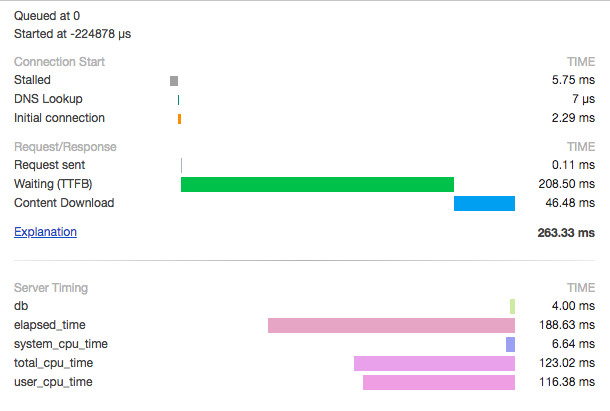

Django Servertiming ⌛
===============================================

Django servertiming is allows you to view performance details for your app in the chrome dev tools. It uses the `Server Timing API
<https://w3c.github.io/server-timing/>`_.

This is how it looks like in chrome: (Available at Chrome → Dev Tools → Network → Timing )

It shows 4 timings

* DB, total time taken by all queries
* Total elapsed time
* User and System CPU time

Installation and Usage
===============================================

* Add :code:`Servertiming` app to your project (Pip install coming soon)
* Add :code`'servertiming.middleware.ServerTimingMiddleware'` to your :code:`settings.MIDDLEWARE`
* Open any page and go to Chrome → Dev Tools → Network → Timing
